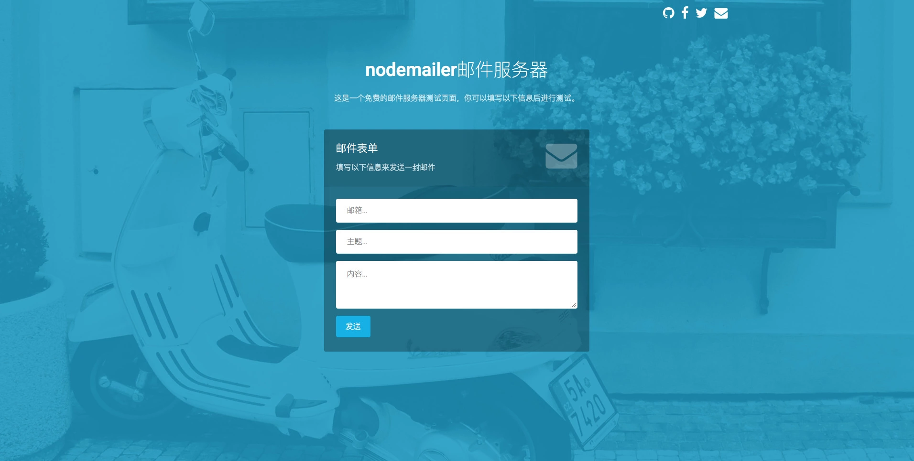

# **express邮件服务器**
<p>
<a href="https://travis-ci.org/momodiy/nodemailer-SMTP-server">
</a>
</p>

## 目录  
* [项目介绍](#项目介绍)  
* [使用说明](#使用说明)
* [重要说明](#重要说明)
* [License](#License)  



<a name="项目介绍"></a>  
## 项目介绍 
一个简单的邮件服务器，使用express+nodemailer+jade构建，可在页面操作实现邮件发送。


<a name="使用说明"></a>  
## 使用说明
### 基本功能
#### **第一步：安装依赖**

```
$ npm i
```
#### **第二步：启动项目**
```
$ npm start
```
默认浏览器会自动打开`localhost:8888`，进入邮件服务器首页。


#### **第三步：发送邮件**

页面中输入你的邮箱、邮件主题、邮件内容，点击发送即可发送一封测试邮件。（发件人为：`stevenrobot@yeah.net`，一个配置好的SMTP邮件服务器邮箱）

### 辅助功能
#### **`nodemon`启动**
使用`nodemon`启动项目后，当代码发生改变项目会自动重启。

```
$ npm run monitor
```

#### **启动测试**
运行mocha测试。
```
$ npm run test
```


#### **代码风格检查**
使用`eslint`进行代码规范检查。（问题已经全部修复）
```
$ npm run eslint
```

<a name="重要说明"></a>  
## 重要说明

**该项目中配置邮件服务器涉及授权码部分我做了代码混淆加密处理，如果想要配置自己的邮箱作为邮件服务器发件邮件，需要以下操作。**

- 在该项目`routes/index.js`文件中
    - 删除35行之后的加密代码
    - 在该文件最后加入以下的配置代码
    - 注意将以下代码中的配置项改为你自己的配置信息，具体操作不再敖述

```js
const mailTransport = nodemailer.createTransport({
    host: '<主机名>',
    port: <端口号>,
    auth: {
        user: '<邮箱>',
        pass: '<授权码>'
    }
});
```

<a name="License"></a>  
## License

MIT License

Copyright (c) 2018 Steven Lee


